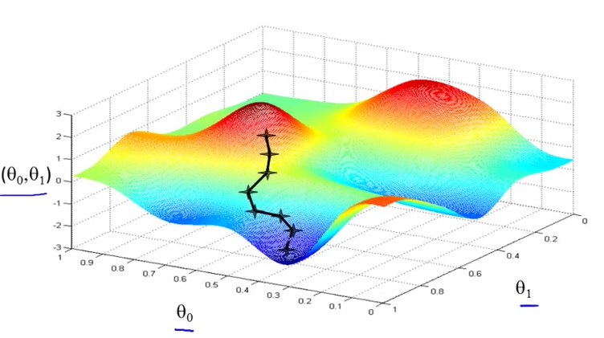
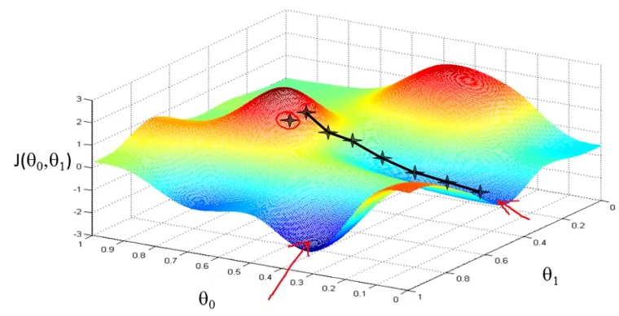

# 1. Gradient Descent
Created Tuesday 02 June 2020

Graddesc is used in many areas of ML.
**Use** - To minimize the cost function.
**Applicability** - General

*****

For the sake of brevity, assume we have only 2 parameters(1 feature) in the cost function.
**Outline:**

* Start with some θ~o,~ θ~1~
* Keep changing θ~o,~ θ~1 ~to reduce J(θ~o,~ θ~1~)
* Until we **hopefully **end up at a minimum.

Situation(Visualize): We are in a grassy golf park, We begin at a point(parameters of the cost function). We l**ook** **360** degrees around us, and move in a **direction** which is the steepest down, so as to **minimize J**. Then we **update **the params to the current point. We repeat the process, until we cannot move down further.

In a nutshell:

1. Start
2. Look for the steepest step down.
3. Move, and update the param values **simultaneously**(for all features).
4. Continue until J is minimized, i.e a convergence is reached.

*****

Gradient descent may lead to multiple solutions, except for univariate hypotheses - where the plot is always convex, so only one solution.

*****

Gradient Descent Algorithm(Math):

α - The distance by which we move called the **learning rate**.

Is a simultaneous important ?
A) Simultaneous and non-simultaneous, both work. But Gradient Descent is usually implemented as simultaneous. Simultaneous updates is what people mean. It's more **natural **way to implement gradient descent. Properties are different, though, for the two, although answer is the same.

