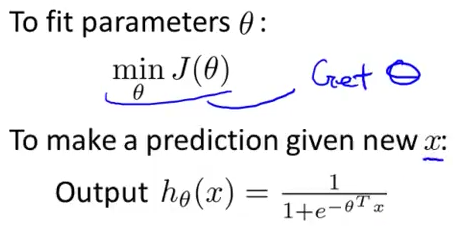

# 2. Simplified Cost function and Gradient Descent
Created Tuesday 09 June 2020

### Simplifying the cost contribution
The cost function is a piece-wise function. It's easy because y(from the dataset) can only be 0 or 1.

So the cost function is:

* There's no* division* by 2.
* There's no *squared* term. 

**Note:** Although it feels like there could be other cost functions, this expression can be derived using the idea of "Maximum Likelihood Estimation" in statistics. There's a deeper rationale and justification behind this.

*****

This cost function is used by most people for logistic regression models.

*****

We'll now try to fit a hypothesis.

For the gradient descent, we need the derivative of J w.r.t θ~j~.
Working out the derivative, the update rule for gradient descent looks like:

We'll do 
	for i=1:num_iters,
		# update the all thetas using vectorized approach

*****

Both linear regression and logistic regression have the update rule. Are they the same?
This is *resolved *by observing that h~θ~(x) is quite different for the two use cases.

* h~θ~(x) = θTX for linear regression.
* h~θ~(x) = 1/1+e^-hθ(x)^ for logistic regression.

They are different, but the **algorithm** *looks* the same.

*****

Feature scaling also helps in logistic regression, using gradient descent.

*****

* It's the most widely used classification algorithm in the world.
* It is very powerful and we now know how it works.

