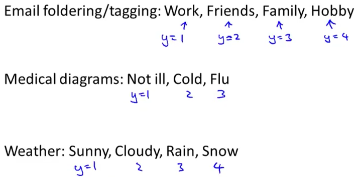
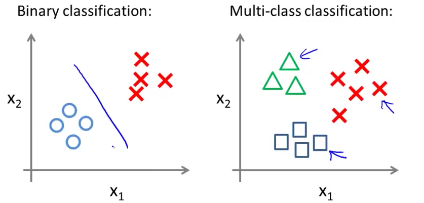
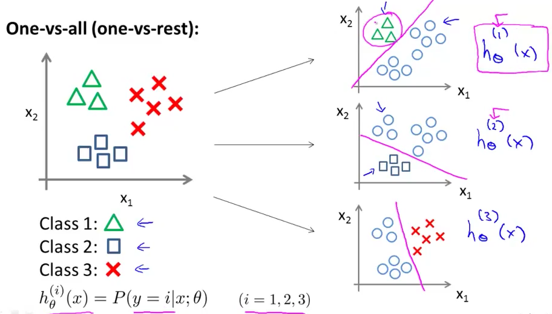

# 3. Multiclass classification
Created Monday 08 June 2020

Multiclass classification:
The number of output values or classes are more than 2. 
Where are these used:

* It doesn't matter if we start indexing from 0 or 1. Professor Ng prefers 1 based indexing for the classes.

*****

How does multi-class data look:

*****

How to do multi-class classification:

* Using the idea of **one-versus-all**. We can extend binary classification for multiple classes. It's very simple and elegant.
* Hypothesis for each class is found one by one.
* We keep the class(current) as positive and the rest of the dataset as negative. We do this for all the classes.
* Eventually, we get the decision boundaries, effectively classifying the whole dataset.

**Jargon**: h~θ~^(i)^(x) represents the probability of 'x' being in the class i, i.e using θ^(i)^.

* Note that number of hypotheses = number of classes = number of theta vector
* The last hypothesis cannot be 'subtracted' from the rest, because we don't have a fixed/contextual universal hypothesis set. We have to do the optimization k times, where k = number of classes.

*****

How to make predictions for a question x. Now that we have classified the data, and obtained the hypothesis for each class.

1. Calculate the probability of the input being a class. 
2. Do this for all classes. 
3. Pick the class where probability is the highest.

