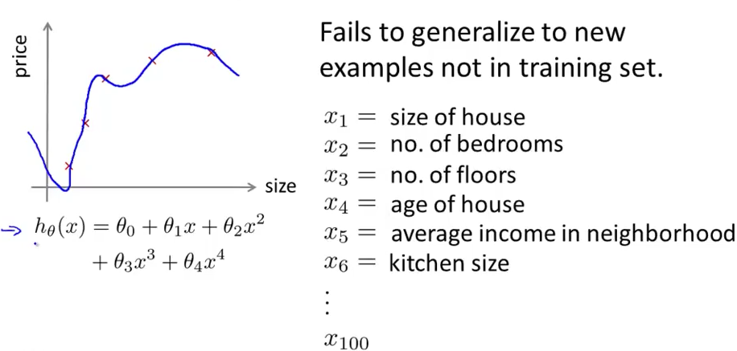
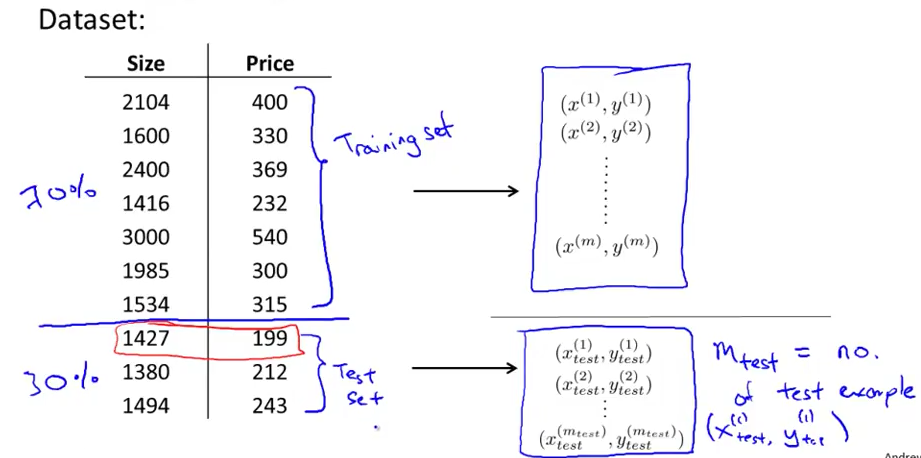
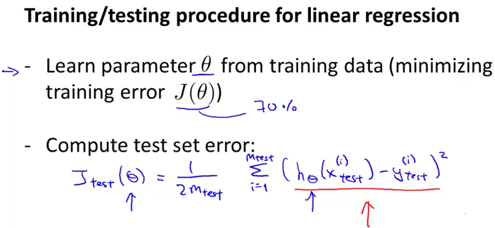
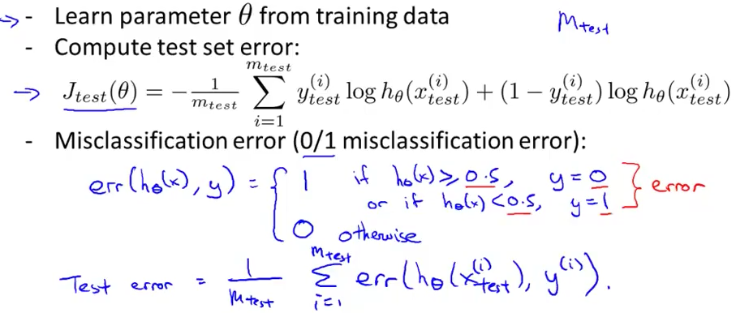

# 2. Evaluating a hypothesis
Created Saturday 20 June 2020

* This visualization can be difficult if we have many features.

*****

The standard way to evaluate an hypothesis is:

1. We split the training example into two parts(70-30), 30% being the test data. 

If the data is sorted, it is better to randomize it before splitting.

2. Computing the error:

 We just calculate the cost function in case of linear regression.

For logistic regression, in addition to the cost function, we can also define a error function:

