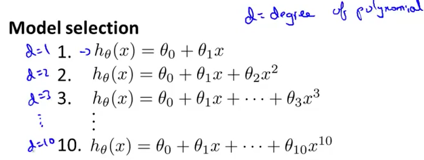

# 3. Model selection and train validation test sets
Created Saturday 20 June 2020

* Generalization error: The error when counted for unseen examples.

Model Selection:

* Other than the parameters θ, another parameter is the degree of the polynomial. 	
* Model selection is nothing but this act of choosing the degree.

* How to select ?
	1. We calculate the test error for each of the model. Then select the model with the least test-error(the error for the 30% test set)
	2. This will not be a fair estimate of the generalization error, in most cases, it is the optimistic estimate of the generalization error. The reason this is true is because of we found the parameter(degree d) using out test data, by choosing the minimum. This is called **0/1 classification error.**
	3. The solution to this is to split the training examples into 3 parts: Training set - 60%, Cross validation set(or validation set) CV - 20% and test data - 20%. We'll use the CV to decide the degree.
	4. We'll pick the hypothesis with the lowest cross-validation error, and then test it for the test set. This error is, by definition, the generalization error.

