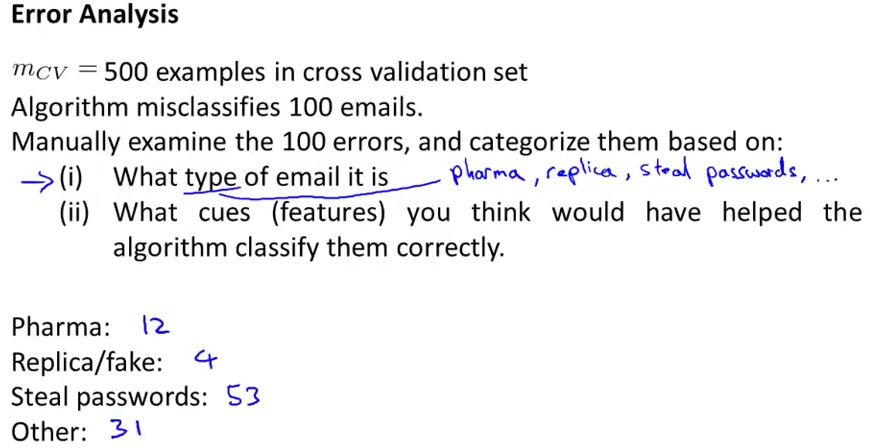

# 2. Error Analysis
Created Thursday 23 July 2020

Recommended approach:

1. Start with a simple(quick) algorithm that we can implement quickly. Implement and test it on the CV data. Max 1 day.
2. Plot learning curves to decide if more data, more features, etc. are likely to help. Let the data **direct** the efforts. Avoid gut feeling methods.
3. Error Analysis - Manually examine the examples(in CV) to check if there are any systematic trends in the wrongly predicted values. This may give us hints if we need additional or complex features. Classify the errors into classes and check their *frequencies*. Check if existing features are hurting the classification process. e.g case(upper and lower), stemming etc.

4. Have a single real number, rating which gives a feedback. Important for quick checks if the algorithm is improving. Here the CV error is a good matric here(in a spam classifier). Better than gut feeling based on observation.
5. Error analysis should be done on the CV set.. .q

