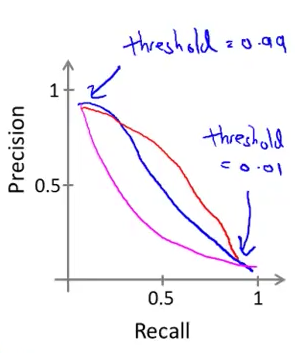
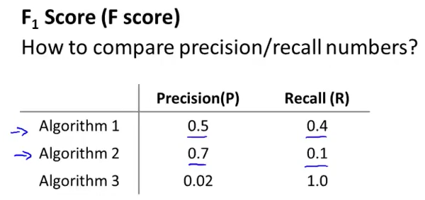

# 2. Trading off precision and recall
Created Thursday 23 July 2020

* For many applications, we'd want to trade-off precision and recall.

If the h() value is higher. we have high precision and low recall. If h() is less, we have low precision and high recall.

* Precision is over-free.
* Recall is overcautious.

* We need to select our goal according to the situation.

 This may very according to different classifiers.

*****

Can we automatically select the correct precision and recall.

* Some answers could be the average. It's not good, because we have two extreme cases. Two radically different things.
* The answer is F~1~ score = Harmonic mean of the two terms.
* There are many possible ways to calculate the score.

