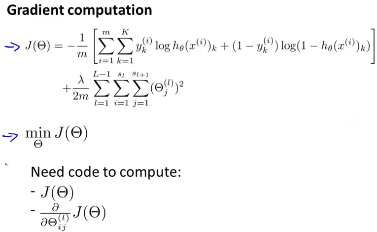
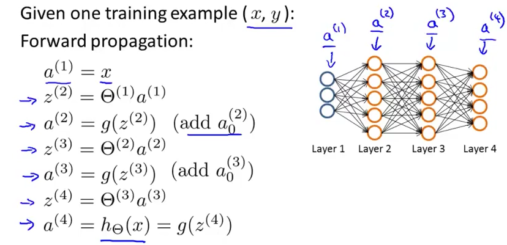
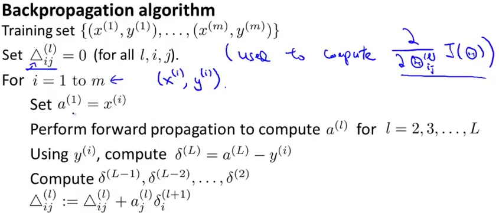

# 2. Backpropagation Algorithm
Created Monday 15 June 2020

We have decided the cost function, let us now minimize the cost function:

In order to use gradient descent or any other advanced algorithm, we need to define for them the cost function and the gradients:

*****

1. For the cost function - we'll use the formula above for cost. We use the **forward propagation**.

As we know all the values, the cost function is calculated.

### -----------------------------

2. For the gradient - we take the derivative of J(Θ) w.r.t all Θs and set it to zero. We use an algorithm called **backpropagation**.

* To simplify the math here, we introduce a new auxiliary variable called the error of the activation unit.

* So the variables are:
	1. Θ^(j)^ the weights matrix from j to j+1 th 
	2. a^(j) ^is the activation values for the jth layer, where a^(1)^ = data example. a^(j)^ = g(z^(j)^) + add the bias weight ⇒ The probability values.
	3. z^(j)^ = Θ^(j-1)^a^(j-1) ^⇒ The real matrix product.
	4. δ^(l) ^= error vector for the lth layer, while coming back. δ^(1)^ is **meaningless**, as it had no computed results from a previous layer. **This is the core of the backpropagation algorithm**.

 No δ^(l)^	
They can be calculated in the following:

1. The g'() term can be calculated easily.
2. δ^(l)^=(Θ^(2)^)^T^δ^(l+1)^.*g'(z^(3)^) - **ignoring** **regularization**

* Steps:
	1. We do forward propagation and compute all the **a**, **z **and **Θ **values for each layer - for a data example.
	2. Next we calculate the deltas and adjust the weights by going backwards(final to input layer)
		* It turns out that the derivative of the cost function w.r.t a weight, Θ^(l)^~ij~ is given by a^(l)^~j~δ^(l+1)^ - **ignoring regularization(**i.e** λ = 0)**
	3. This is done for all the training examples.

* Finally, we have all our weights correct, for predicting the value, we just run the unknown example through the ANN, **forward propagation**. The class corresponds to the maximum value of in the output/final layers.

*****

### This was too much let's write down the whole process succinctly

* Here Δ^(l)^~ij ~are used to calculate the derivative for the activation unit. All layers have it, except the output layer.

 

* These were the errors. We need the derivative. We can show the following mathematically.
* D^(l)^~ij ~= Weights matrix for the activation layer.
* Note the regularization term here.

