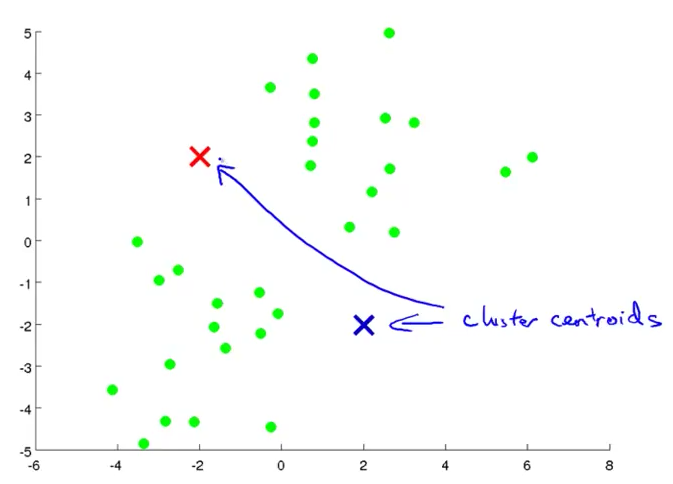
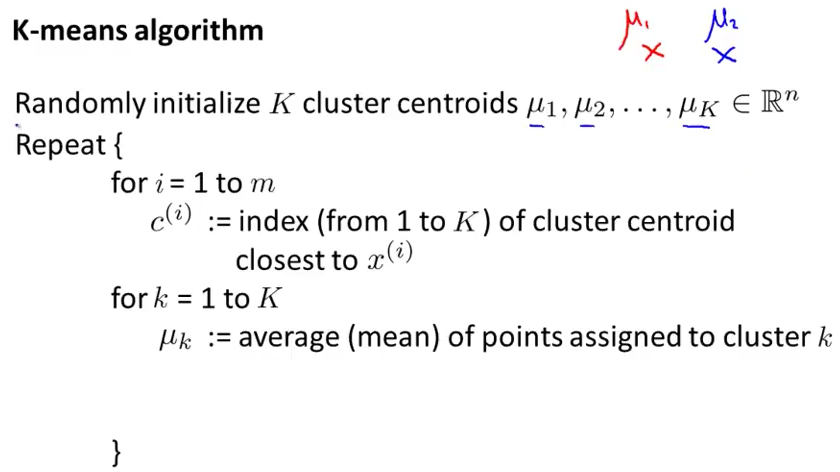
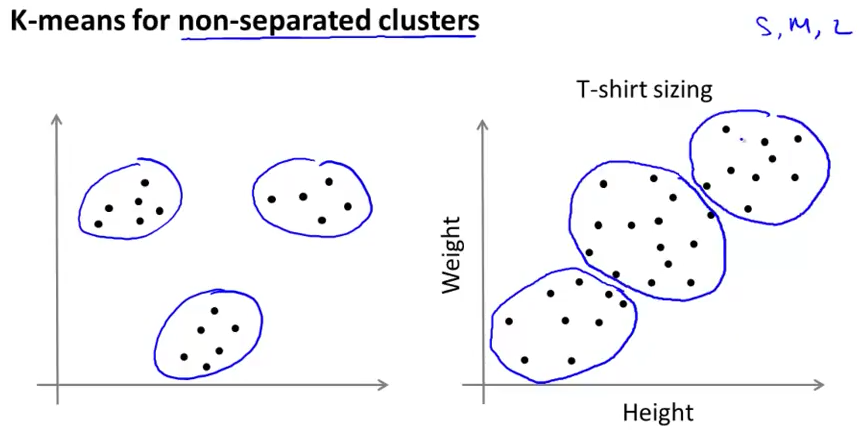

# 2. K-Means clustering algorithm
Created Friday 31 July 2020

Steps for the algorithm:

1. Intitalize the k cluster centroids randomly in the data set.

2. **Color** the populations according to their nearest centroid.
3. **Move** the cluster centroids to their respective population means(centroid).
4. Repeat step 2 and 3.
5. The final situation will be the one where the cluster centroids stop moving, as they now represent their populations the best.

* Note: It's a convention to use distance^2^, instead of the distance. We mimize it's sum. Both give the same result.

* If there's a cluster centroid with no points, it is discarded. Another approach is to randomly reinitialize it.

*****

K means is also good with non seperated clusters.

* Used for market segmentation.

